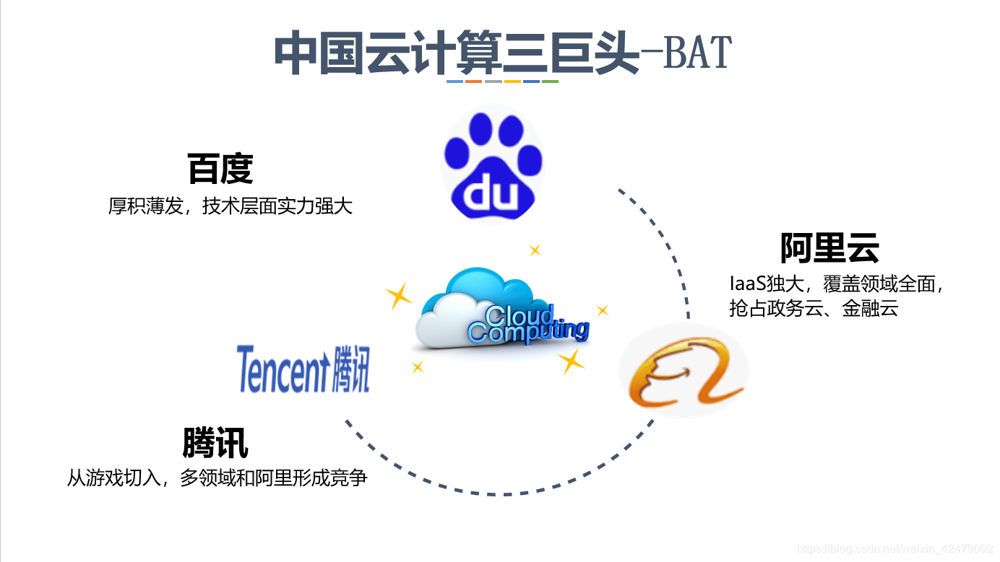

# 互联网时代的热点领域选择、营销方法
---
## 一、热点领域

### 1、 AI人工智能

.jpg)
> 作为近几年以来非常流行于IT行业的技术与学科门类，AI人工智能可谓是占据了互联网的一席龙头，随着计算机行业的飞速发展，越来越多的
机构与公司开始把研究的方向转向为AI的领域，小到我们日常的手机语音助手，大到人工智能的机器人，AI几乎存在于生活中的每个
角落，在当代无时无刻不在影响着我们的生活，城市里，随处可见的都是机器人，以及著名的“阿尔法狗”打败韩国围棋高手的事例，以及今年的
百度年终大会上推出的新的机器人等等，无不在向我们传达着一个信息——AI真的来了。

### 2、云计算

> 说起互联网的热点，又有谁能够不来提及云计算呢？这一在互联网领域享有盛名的领域，当之无愧的成为当下的热点之一。云计算（Cloud Computing），
是一种基于互联网的计算方式，通过这种方式，共享的软硬件资源和信息可以按需求提供给计算机各种终端和其他设备。国内的巨头公司就是我们耳熟能详的
【B（百度）-A（阿里）-T（腾讯）】

### 3、网络5G

> 5G网络作为第五代移动通信网络，其峰值理论传输速度可达每秒数十Gb，这比4G网络的传输速度快数百倍，整部超高画质电影可在1秒之内下载完成.这是什么
概念？我们现在的网络4G的情况之下，相比较于七八年以前的3G网络，实际上速度已经有了不小的提升，但最多也就把网速提高到2-5Mb的状况，相较于10Gb，差了
几千倍。在当今时代之下疯狂追求流量与阅览的效率的前提下，5G的实现，将会是人类社会的又一大革命。

.jpg)

## 二、营销方法

### 营销案例

* 【创意营销】：华为荣耀 6 Plus、可口可乐、JEEP、杜蕾斯、加多宝、奥迪

* 【整合营销】：滴滴专车、多乐士、宝马 1 系、美团、红牛、vivo

* 【移动营销】：《何以笙箫默》、绿箭、西门子、美汁源、KFC、IMAX、必胜客

* 【电子商务营销】：TCL、万科、丹麦蓝罐曲奇、别克新君威、361°、CAMEL

* 【社会化营销】：中国孤独者粘会、《小爸爸》、“三个爸爸”、联想、碧浪、美年达、中国平安

* 【视频营销】：蒙牛、香港迪士尼乐园、New Balance、雪佛兰迈锐宝、东风标致3008、长安福特嘉年华

* 【饥饿营销】：成功让小米跻身世界前列

.jpg)
.jpg)
