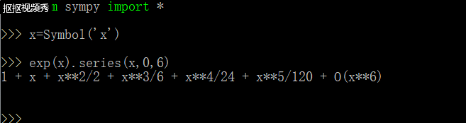
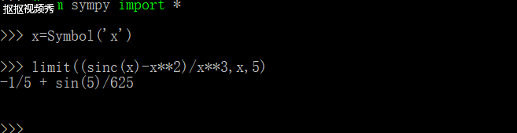
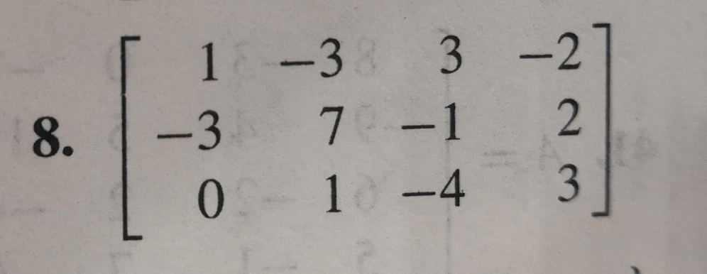
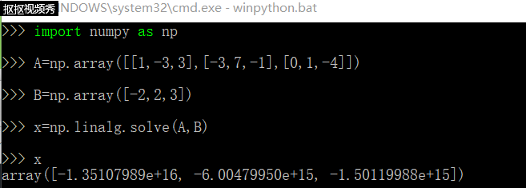
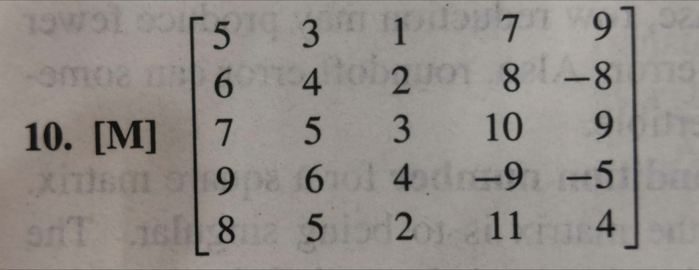
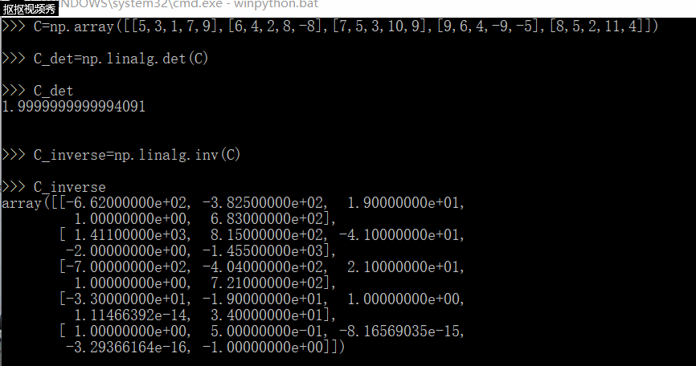

用 python 做计算器，做数学题
=
## 一、高数问题

---
### 1. 泰勒分解
---
**$$e^x$$展开式**

### 2. 求极限
---
**$$\limit_{x\to 0}\frac{\sinc(x)-x^2}{x^3}$$**

## 线代问题
###### 声明一下，下面两题是我随便找的，所有数据可能不常规

---
### 1.矩阵化简求解
---
#### 题目

#### 正解

### 2. 求逆阵
---
#### 题目

#### 正解

